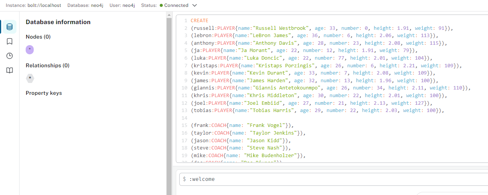

# Express Neo4j API - Playground example
This project is an Express API that interacts with a Neo4j graph database to perform CRUD operations for persons. 

## Installation

1. Clone the repository:
```bash
   git clone https://github.com/spooner8/express-neo4j-example.git
```

2. Change to repository directory:
```bash
   cd express-neo4j-api
```

3. Install the dependencies:
```bash
   npm install
```

4. Configure the Neo4j database connection in `src/config/neo4jConfig.ts`.

## Usage with existing Database (Connection from step 3 above)

To run the application, use the following command:
```bash
   npm start
```

The API will be available at `http://localhost:3000`.

## API Endpoints

***Nodes***

- **POST /persons**: Create a new person. -> json {name, age, email}
- **GET /persons**: Retrieve all person nodes.
- **GET /persons/:id**: Retrieve a person by ID.
- **PUT /persons/:id**: Update a person by ID.
- **DELETE /persons/:id**: Delete a person by ID.

***Relationships***

- **POST /persons/relationship**: Create a new relationship. json -> {personId1, personId2, relationshipType}

## Docker

To run the application using Docker and new Database, follow these steps:

1. Update the docker-compose.yml
   - Set api image to your build name (recommendet -> express-neo4j-example)
   - Set connection conditions to the conditions in your neo4jConfig.ts (db and api)

2. Build the Docker image for the API:
```bash
   docker build -t express-neo4j-example .
```

3. Start the services using Docker Compose:
```bash
   docker-compose up -d
```

The application and Neo4j database will be running as container stack.

## Access:
- API: The API will be available at `http://localhost:3000`.
- DB: The Database will be available at `http://localhost:7474/browser/preview`
- Protocol: ***bolt://***
- Connection URL: ***db*** (Service name)
- Database user: ***neo4j*** (Default - or what you set in the neo4jConfig.ts)
- Database password: ***Test1234*** (Default - or what you set in the neo4jConfig.ts)

## Try yourself:
If you want to have some Mockdata, you can simply past the content of the mockdata.txt file to your new Database. Paste it to the input and hit play in the right upper edge of the input.



## Nice! Your playground is ready. <br>Enjoy your Database directly or with the Endpoints above <br> or with Postman, for example

## License

This project is licensed under the MIT License.